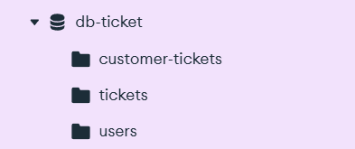

# Eventify - Microservices

## Overview

This project was developed as part of a challenge proposed by Compass UOL.

Eventify is composed of two independent Spring Boot microservices that communicate through REST APIs using OpenFeign.

- **Event Manager** – responsible for managing events.
- **Ticket Manager** – responsible for ticket sales and purchased tickets.

Each microservice has its own MongoDB database, following the Database per Service pattern.

---

## Technologies & Tools

- Java 17
- Spring Boot 3.5.4
- MongoDB Atlas
- Spring Security
- JWT
- OpenFeign
- Docker
- Swagger / OpenAPI
- Render

> Originally deployed on AWS EC2 during the Compass UOL challenge.

---

# Deployment

Both microservices are currently deployed on Render.

| Microservice | Base URL |
|--------------|----------|
| Event Manager | https://eventify-ms-events.onrender.com |
| Ticket Manager | https://eventify-ms-tickets.onrender.com |

> **Note**
>
> These URLs are the base addresses of the REST APIs.
> Opening them directly in a browser may display a blank page or a default Spring Boot page because no frontend is provided.
>
> To explore and test the APIs, use the Swagger documentation below.

---

# API Documentation

The APIs can be explored and tested directly through Swagger UI.

| Microservice | Swagger | Authentication |
|--------------|----------|----------------|
| Event Manager | https://eventify-ms-events.onrender.com/swagger-ui/index.html | Not required |
| Ticket Manager | https://eventify-ms-tickets.onrender.com/swagger-ui/index.html | JWT Authentication |

### Example Endpoints

#### Event Manager

```http
GET https://eventify-ms-events.onrender.com/api/v1/events
```

#### Ticket Manager

```http
POST https://eventify-ms-tickets.onrender.com/auth/login
```

```http
GET https://eventify-ms-tickets.onrender.com/api/v1/tickets
```

> Protected endpoints require a valid JWT access token.

---

# Authentication

The **Ticket Manager** is responsible for authentication and authorization.

- JWT Authentication
- Access Token generation
- Refresh Token endpoint *(currently not functional in this version)*

All users created through the API receive the `ROLE_CUSTOMER` role.

Administrator users (`ROLE_ADMIN`) must be created manually in the database.

The **Event Manager** endpoints are currently public.

Authentication for this microservice is planned for a future version alongside the frontend currently under development.

---

# Microservices Description

## Event Manager

Responsibilities:

- Manage events.
- Verify whether tickets exist before allowing an event to be cancelled.
- Notify the Ticket Manager when event information changes.
- Consume the ViaCEP API to automatically retrieve address information based on the provided CEP.

## Ticket Manager

Responsibilities:

- Manage tickets available for sale.
- Manage purchased customer tickets.
- Authenticate users with JWT.
- Retrieve event information from the Event Manager before creating tickets.

Authorization:

- `ROLE_ADMIN`
  - Create, update and remove tickets for sale.

- `ROLE_CUSTOMER`
  - Purchase tickets.
  - Manage their own purchased tickets.

---

# Database Overview

Each microservice owns its own MongoDB database.

## Event Manager Database

Collections:

- `events`

Stores all event information.


---

## Ticket Manager Database

Collections:

- `tickets`
- `customerTickets`
- `users`

The `users` collection stores both administrators and customers.



---

# Creating an Admin User Manually

Administrator users must be inserted directly into the MongoDB database.

The password below corresponds to:

```
admin
```

It was generated using the same BCrypt configuration used by this application.

```javascript
db.users.insertOne({
  "username": "admin@test",
  "password": "$2a$10$p2of5mko0/cqxFOt/kSh7.6wQWS8Xho13Qg7lTBymOlZ3qsimGjfK",
  "fullname": "Main Administrator",
  "cpf": "000.000.000-00",
  "accountNonExpired": true,
  "accountNonLocked": true,
  "credentialsNonExpired": true,
  "enabled": true,
  "role": "ROLE_ADMIN",
  "_class": "com.arcilio.henrique.ms_ticket_manager.domain.model.User"
});
```

If you prefer generating your own password:

```java
BCryptPasswordEncoder encoder = new BCryptPasswordEncoder();
String encoded = encoder.encode("your-password");
System.out.println(encoded);
```

---

# Environment Variables

## Event Manager

```yaml
spring:
  application:
    name: ms-event-manager

  data:
    mongodb:
      uri: ${MONGO_URL}

  cloud:
    openfeign:
      okhttp:
        enabled: true

feign:
  data-resource:
    url: ${VIA_CEP_URL}

  ticket-manager:
    url: ${TICKET_MANAGER_URL}
```

Variables:

| Variable | Description |
|----------|-------------|
| MONGO_URL | MongoDB connection string |
| VIA_CEP_URL | ViaCEP base URL |
| TICKET_MANAGER_URL | Base URL of the Ticket Manager |

Example (Local):

```text
TICKET_MANAGER_URL=http://localhost:8080/api/v1
```

Example (Render):

```text
TICKET_MANAGER_URL=https://eventify-ms-tickets.onrender.com/api/v1
```

---

## Ticket Manager

```yaml
spring:
  application:
    name: ms-ticket-manager

  data:
    mongodb:
      uri: ${MONGO_URL}

security:
  jwt:
    token:
      secret-key: ${SECRET_KEY}
      expire-length: ${JWT_EXPIRATION_LENGTH}

feign:
  event-manager:
    url: ${EVENT_MANAGER_URL}
```

Variables:

| Variable | Description |
|----------|-------------|
| MONGO_URL | MongoDB connection string |
| SECRET_KEY | JWT secret key |
| JWT_EXPIRATION_LENGTH | JWT expiration time (milliseconds) |
| EVENT_MANAGER_URL | Base URL of the Event Manager |

Example (Local):

```text
EVENT_MANAGER_URL=http://localhost:8081/api/v1/events
```

Example (Render):

```text
EVENT_MANAGER_URL=https://eventify-ms-events.onrender.com/api/v1/events
```
